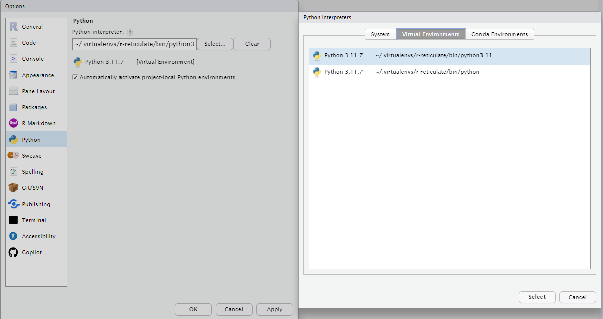

# MUFBVAR

Module to handel, disaggregate and forecast Multiple frequency data using Bayesian VAR Models.

[Documentation Markdown](./docs/_build/markdown/index.md)


# Installation

Install via pip:
```console
foo@bar:~$ pip install git+https://gitea.efv.admin.ch/efv_fs/MUFBVAR.git
```


# Example code

[Python Example](./docs/_build/markdown/source/examples.md)

[R Example](./docs/_build/markdown/source/examples.md)

# Use in R studio

To use the module in R studio, a virtual python environment must be set up and the library `reticulate` must be used.

## Virtual Python environment setup

1. In RStudio click on Tools -> Global Options
   


2. Go to `Python`, and then click `Select...`
   


3. Go to `Virtual Environments` tab and select the virtual environment including a Python version (e.g. ../python3.11)
   
